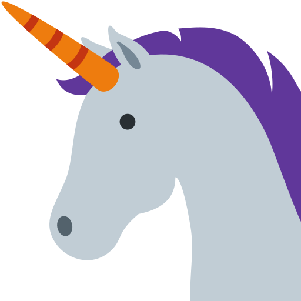

#  &nbsp;[Unicorn Konami](https://edelstone.github.io/unicorn-konami/)

## How does this work?

[Visit the site](https://edelstone.github.io/unicorn-konami/), click the link or use the Konami code, and the unicorns will appear from the magical forest.

## Can I use this code for whatever I want?

Yes. It is your duty to do so.

## Why does this exist?

I mean, just look at yourself for even asking that.

## Resources

- [Why do unicorns represent light?](https://www.youtube.com/watch?v=Q1Ark0BUu6o)
- [Unicorn behavior and family dynamics](https://www.youtube.com/watch?v=Z1aX1i79rY8)